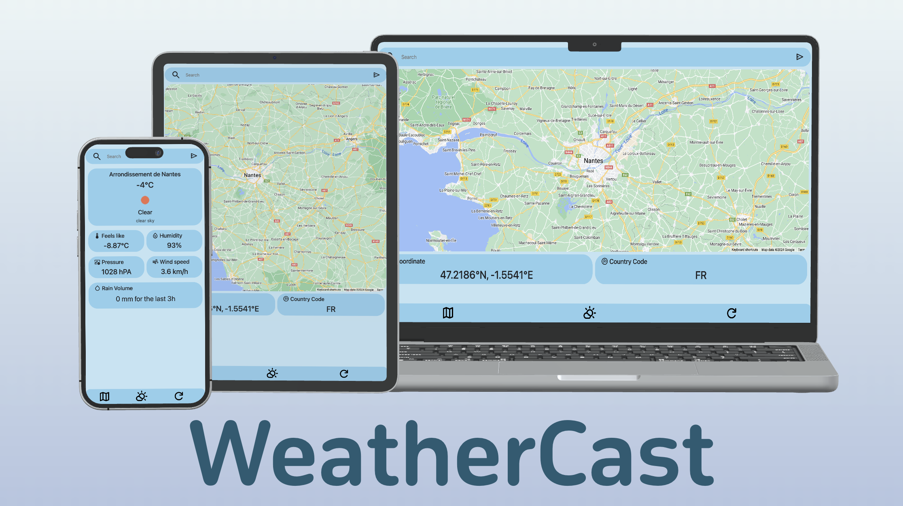

# WeatherCast

**WeatherCast** is a simple weather application that provides real-time weather information based on user input or current location. It uses APIs to gather data and display it on a user-friendly interface based on **Material UI**.



***
#### Project Structure

The project is structured as a **Node.js**, **Express** application with multiple routes for handling different functionalities. 
***

#### Key Design Decisions

+ **Modularization**: The project is organized into separate modules to enhance maintainability and readability.

+ **Asynchronous Requests**: Asynchronous programming using async/await is employed to handle API requests efficiently.

+ **Environment Variables**: Sensitive information such as API keys is stored in environment variables (.env) to enhance security.

***
#### API Usage Details
+ **OpenWeatherMap APIs**
  + [Weather Data](https://openweathermap.org/current)
    + [GeoCoding API](https://openweathermap.org/api/geocoding-api)
  + **Google Cloud APIs**
    + [Maps JavaScript API](https://console.cloud.google.com/apis/library/maps-backend.googleapis.com)
  + **IPINFO APIS**
    + [ipinfo API](https://ipinfo.io)

***
### Installations

#### Step 1: Install Node.js and npm

Make sure you have **Node.js** and **npm (Node Package Manager)** installed on your machine. You can download and install them from the official website: [Node.js](https://nodejs.org/).

#### Step 2: Clone the Repository

Clone the repository

```bash
git clone https://github.com/DarkHoust/WeatherCast.git
cd WeatherCast
```

#### Step 3: Install Dependencies

Install the required **npm packages** by running the following command in your terminal:
```bash
sudo npm install 
```
This will install the necessary dependencies specified in your **package.json** file.

#### Step 4: Run the Application

Start the application using the following command:
```bash
node app
```

#### Step 5: Access the Application

Open your **web browser** and go to "**http://localhost:3000**" to access to **WeatherCast**.

***
#### Author 
Sultan **'DarkHost'**


